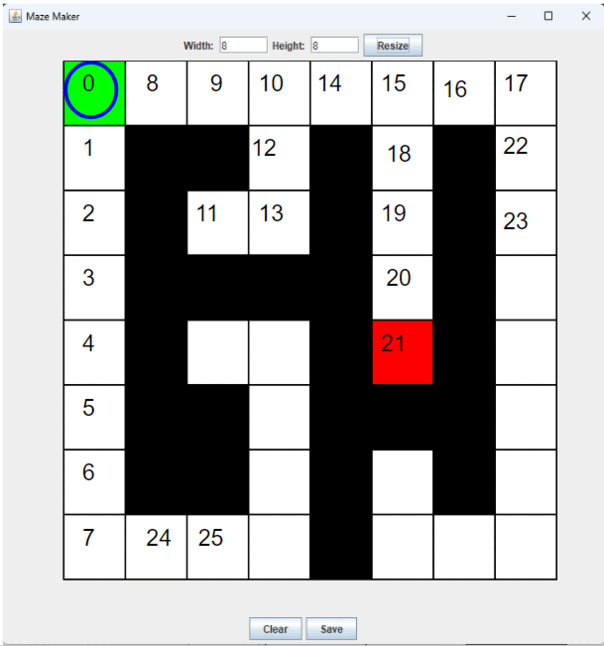
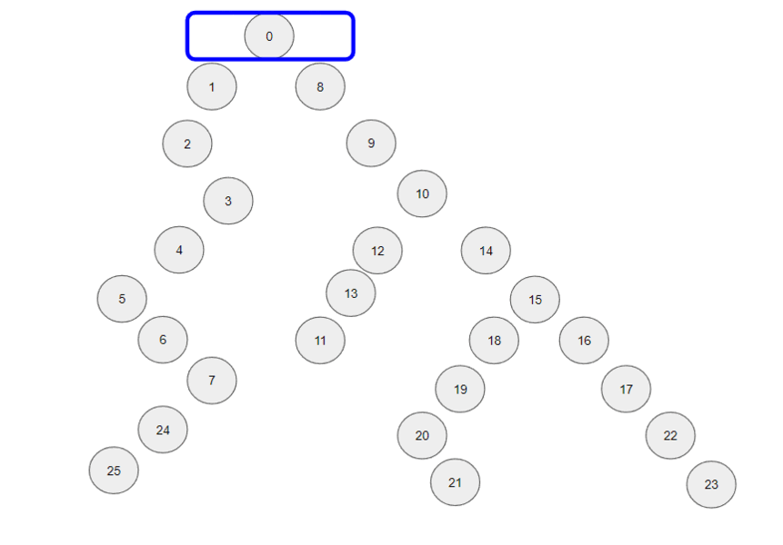

# MicroMouse
There are 2 Parts to this project
First there is the MazeMaker which is a UI for designing mazes
Second there is the MazeSolver which is supposed to emulate a micromouse solving the maze

## MazeMaker
The goal for this is that it will create a maze on it own but to make it quicker to design mazes manually I created a simple GUI that lets you make the maze. Then the maze maker outputs the maze to a text file that can then be imported by the maze solver.

### How the Manual GUI works

### How the Maze Generating Algorithm works

## MazeSolver
The goal of this is that I will be able to create and test different maze solving algorithms just to learn how to design better algorithms.
### Breadth First Search (BFS)
Breadth first seach works by expanding its search by one cell in all directions. Another way this can be throught of is as a tree and it is searching the tree row by row. As you can see in the animation, the breadth first search is searching at 3-4 different places in the maze and each of those can be seen to be at the same depth in the bianry tree on the right. BFS

### Drawbacks of the Breadth First Search
As an algorithm on its own, the breadth first search algorithm is highly efficient and is guaranteed to find the shortest path to the finish. However, as an algorithm for a micromouse, this algorithm is very impractical. This is because the mouse would need to be checking 3+ different squares at very different parts of the maze and it would become inefficient in the time lost jumping back and forth between locations to be checked.

### Depth First Search
Depth first search works by going as deep as possible in one direction (i.e. until it reaches a dead end) then it backtracks to the last spot where the path split and follows that path until it reaches a dead end. This continues until it finds the end. 